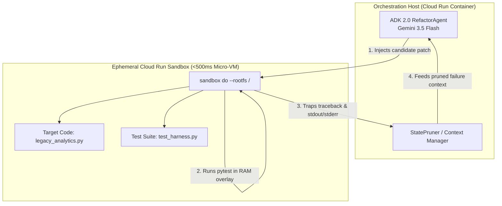

# Cloud Run Sandboxes: Isolated Ephemeral Execution for AI Coding Agents

## 1. Overview & Architectural Motivation

In AI agent workflows, executing model-generated code introduces a fundamental conflict:
- **Running directly in host containers** exposes environment variables, cloud metadata credentials (`http://169.254.169.254`), and local filesystems to accidental corruption or prompt injection attacks.
- **Spawning heavy VMs or standard containers per task** adds 3 to 10 seconds of cold-start latency per turn, stalling multi-turn self-correction loops.

**Cloud Run Sandboxes** (Public Preview) resolve this trade-off by spinning up hardware-isolated micro-VM execution boundaries in **under 500 milliseconds**, running with locked-down network egress, unreachable Google Cloud metadata servers, and copy-on-write memory overlays that discard changes upon exit.

---

## 2. Directory Layout & Module Breakdown

```text
cloud-run-sandbox/
├── __init__.py                  # Package exports and versioning
├── main.py                      # Unified entrypoint (auto-routes between Job and Service modes)
├── Procfile                     # Buildpack process definition (web: python main.py)
├── requirements.txt             # Standalone Python dependencies for Buildpacks source deployment
├── README.md                    # Technical documentation & execution guide
├── sandbox_runner.py            # Low-level Cloud Run Sandbox CLI (`sandbox do`) wrapper & fallback
├── repair_loop.py               # Self-correcting Python 2-to-3 modernization loop with state pruning
├── server.py                    # Lightweight HTTP server for Cloud Run Service deployments
├── telemetry.py                 # SandboxTelemetry & ExecutionTrace Pydantic schemas
├── run_sandbox_experiments.py   # Unified CLI benchmark runner
├── deploy_sandbox_job.sh        # Source-based deployment automation for Cloud Run Jobs with --sandbox-launcher
├── deploy_sandbox_service.sh    # Source-based deployment automation for Cloud Run Services with --sandbox-launcher
```

---

## 3. Core Architecture: The 3 Zero-Trust Security Boundaries



1. **Metadata Server Isolation**: Sandboxes cannot reach `http://169.254.169.254` to fetch service account OAuth tokens or inspect host project configurations.
2. **Deny-by-Default Egress**: All outbound network connections are dropped at the hypervisor layer unless `--allow-egress` is explicitly enabled.
3. **Copy-on-Write Memory Overlays**: The host filesystem is mounted read-only at `/`, granting access to installed dependencies. All writes occur in an ephemeral RAM overlay that is destroyed upon process exit.

---

## 4. How to Run

### Run Unit Tests
```bash
.venv/bin/pytest tests/test_cloud_run_sandbox.py -v
```

### Run Benchmarks in Mock/Offline Mode
```bash
.venv/bin/python -m cloud-run-sandbox.run_sandbox_experiments --mock
```

### Run Security Isolation Check
```bash
.venv/bin/python -m cloud-run-sandbox.run_sandbox_experiments --verify-security
```

### Run Live Multi-Turn Modernization Experiment (GEAP)
```bash
export GOOGLE_GENAI_USE_ENTERPRISE="true"
export GOOGLE_CLOUD_PROJECT="your-project-id"
export GOOGLE_CLOUD_LOCATION="global"
.venv/bin/python -m cloud-run-sandbox.run_sandbox_experiments
```

### Deployment Option 1: Cloud Run Jobs (Batch Execution)
Deploy the agent directly from source as a run-to-completion Cloud Run Job:
```bash
bash cloud-run-sandbox/deploy_sandbox_job.sh
```
Or execute via gcloud CLI directly from source:
```bash
gcloud beta run jobs deploy adk-sandbox-job \
    --source cloud-run-sandbox \
    --region=us-west1 \
    --sandbox-launcher
```
Execute the batch job:
```bash
gcloud beta run jobs execute adk-sandbox-job --region=us-west1 --project=$GOOGLE_CLOUD_PROJECT
```

### Deployment Option 2: Cloud Run Service (REST API Endpoint)
Deploy the agent directly from source as a persistent HTTP service:
```bash
bash cloud-run-sandbox/deploy_sandbox_service.sh
```
Or execute via gcloud CLI directly from source:
```bash
gcloud beta run deploy adk-sandbox-service \
    --source cloud-run-sandbox \
    --region=us-west1 \
    --sandbox-launcher \
    --allow-unauthenticated
```
Trigger the repair loop via HTTP POST:
```bash
SERVICE_URL=$(gcloud run services describe adk-sandbox-service --region=us-west1 --format="value(status.url)")
curl -X POST "$SERVICE_URL/run" -H "Content-Type: application/json" -d '{"mock": false}'
```

---

## 5. Telemetry & Results Format

Results are output directly to stdout as structured JSON and saved to `results/sandbox_telemetry.json`:

```json
{
  "scenario_name": "Python_2_to_3_Semantic_Migration",
  "target_module": "legacy_analytics.py",
  "total_iterations": 3,
  "functional_test_passed": true,
  "sandbox_native_execution": false,
  "metadata_blocked_verified": true,
  "egress_denied_verified": true,
  "wall_clock_latency_seconds": 3.842,
  "total_input_tokens": 1420,
  "total_output_tokens": 395
}
```
