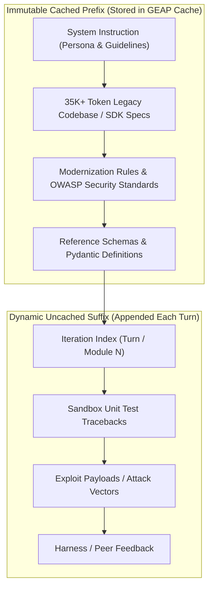

# Google ADK 2.0 Context Caching Implementation & Analysis

## 1. Overview & Architectural Motivation

In complex multi-agent systems and iterative development loops (e.g. multi-target batch modernization, multi-file dependency refactoring, and multi-turn adversarial reviews), LLM agent harnesses traditionally re-send massive prompt contexts across every turn. For an enterprise migration with a 35K+ token reference codebase, a $K$-turn workflow results in **geometric token escalation**:

$$\text{Uncached Total Input Tokens} = K \times (\text{Codebase Prefix Tokens} + \text{Suffix Tokens})$$

By integrating **Gemini Context Caching** via the Gemini Enterprise Agent Platform (GEAP) unified SDK (`google-genai`) and Google ADK 2.0, the immutable codebase or specification is tokenized and stored in cache memory once. Subsequent turns submit only the dynamic execution delta (e.g., unit test tracebacks, exploit payloads, or file-specific refactoring instructions).

### Dual Metrics Accounting Model:

1. **Physical Transmitted Token Savings (Bandwidth & Ingestion Volume)**:
   $$\text{Cached Transmitted Tokens} = \text{Prefix Tokens} + \sum_{k=1}^K \text{Dynamic Suffix Tokens}_k$$
   $$\text{Transmitted Tokens Saved} = (K - 1) \times \text{Prefix Tokens}$$
   $$\textbf{Physical Token Reduction: } \mathbf{\sim 75\%\text{--}80\% \text{ for } K \ge 4}$$

2. **GEAP Cost-Equivalent Savings (Google Cloud 0.25x Cached Read Multiplier)**:
   Gemini Enterprise Agent Platform (GEAP) bills cached content reads at a 75% discount ($0.25\times$ base prompt token price):
   $$\text{Cost-Equivalent Billed Tokens} = \text{Prefix Tokens} \text{ (write)} + 0.25 \times (K \times \text{Prefix Tokens}) \text{ (reads)} + \sum_{k=1}^K \text{Dynamic Suffix Tokens}_k$$
   $$\textbf{Invoice Cost Reduction: } \mathbf{\sim 50\%\text{--}55\% \text{ for } K \ge 4}$$

---

## 2. Solving the "Prefix-Breaking" Problem

Context caching in modern transformer architectures requires an exact byte-for-byte token prefix match. If dynamic runtime values (such as timestamps, UUIDs, or cycle counters) bleed into the system instruction or codebase header, the cache key is invalidated, causing a cache miss.



The `CachePayloadBuilder` in this module strictly enforces this separation:
* `assemble_static_prefix()` constructs and hashes (SHA-256) the static portion.
* `assemble_dynamic_suffix()` formats all execution deltas into an appended suffix.
* `verify_prefix_invariance()` programmatically verifies that the call payload begins with the exact cached prefix.

---

## 3. Directory Layout & Module Breakdown

```text
context-caching/
├── __init__.py                     # Package exports
├── cache_manager.py                # ContextCacheManager & CachePayloadBuilder
├── telemetry.py                    # ContextCacheTelemetry & CacheLifecycleEvent schemas
├── multi_target_suite.py           # Scenario 1: Multi-Target Batch Modernization (K=5)
├── adversarial_security_debate.py  # Scenario 2: Adversarial SQLi Red/Blue Debate (K=4)
├── multi_file_refactoring.py       # Scenario 3: Multi-File Dependency Graph Modernization (K=4)
├── run_caching_experiments.py      # Unified CLI Benchmark Runner
└── README.md                       # Technical Architecture & Usage Guide
```

---

## 4. Workloads Implemented

### 4.1 Scenario 1: Multi-Target Batch Modernization ($K=5$)
* **Workload**: Batch modernization of 5 distinct legacy Python modules ([`legacy_analytics.py`](../targets/legacy_analytics.py), `pipeline_transformer.py`, `export_formatter.py`, `auth_validator.py`, `metric_aggregator.py`) against a shared 37.6K-token monorepo prefix.
* **Token Efficiency**: **79.43% transmitted token reduction** (150,636 tokens saved) | **54.61% GEAP cost reduction**.

### 4.2 Scenario 2: Adversarial SQLi Red/Blue Security Debate ($K=4$)
* **Workload**: 4-turn debate between Red Team (crafting SQLi bypass exploits) and Blue Team (refactoring queries to parameterized statements) against a 38.3K-token OWASP specification.
* **Token Efficiency**: **74.74% transmitted token reduction** (115,101 tokens saved) | **49.83% GEAP cost reduction**.

### 4.3 Scenario 3: Multi-File Dependency Graph Refactoring ($K=4$)
* **Workload**: Cascading refactoring of 4 interconnected microservices (`db_helper.py`, `user_dao.py`, `admin_service.py`, `analytics_service.py`) against a 38.4K-token ORM SDK.
* **Token Efficiency**: **74.65% transmitted token reduction** (115,323 tokens saved) | **49.77% GEAP cost reduction**.

---

## 5. How to Run

### Run Unit Tests
```bash
.venv/bin/pytest tests/test_context_caching.py -v
```

### Run Benchmarks in Mock/Offline Mode
```bash
.venv/bin/python -m context-caching.run_caching_experiments --scenario=all --mock
```

### Run Benchmarks with Live Gemini Enterprise Agent Platform (GEAP)
```bash
export GOOGLE_GENAI_USE_ENTERPRISE="true"
export GOOGLE_CLOUD_PROJECT="<YOUR_PROJECT_ID>"
export GOOGLE_CLOUD_LOCATION="global"
.venv/bin/python -m context-caching.run_caching_experiments --scenario=all
```
